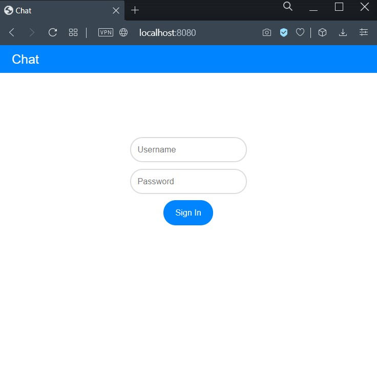
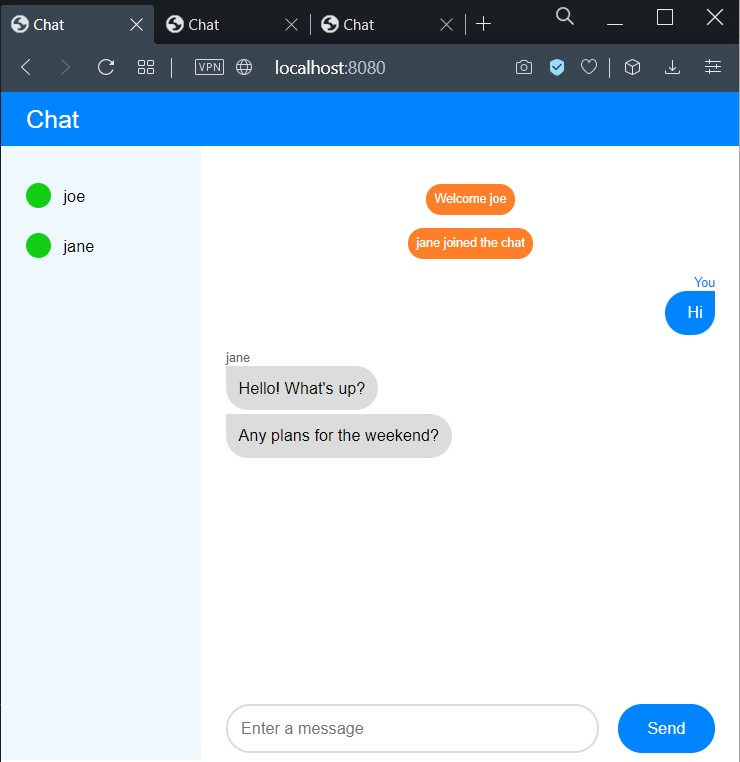
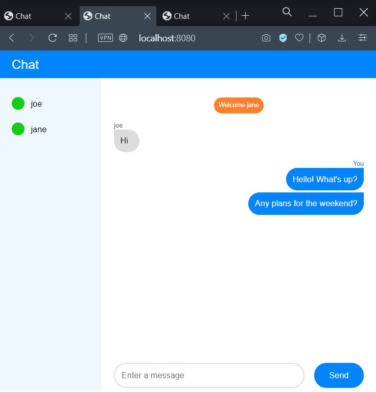
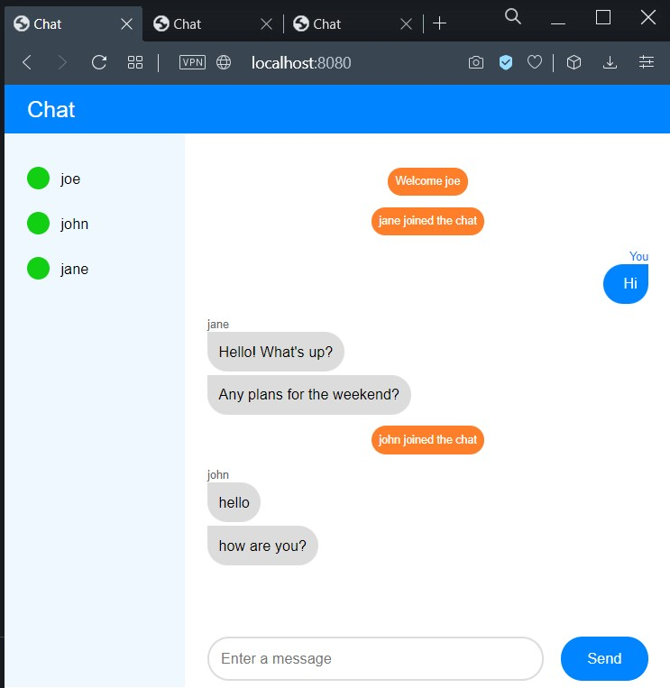

# chat application with WebSockets

## Building and running this application

Follow these steps to build and run this application:

1. Open a command line window or terminal.
1. Navigate to the root directory of the project, where the `pom.xml` resides.
1. Compile the project: `mvn clean compile`.
1. Package the application: `mvn package`.
1. Change into the `target` directory: `cd target`
1. You should see a file with the following or a similar name: `chat-1.0.jar`.
1. Execute the JAR: `java -jar chat-1.0.jar`.
1. A page to test the application will be available at `http://localhost:8080`.
   1. The authentication endpoint will be available at `http://localhost:8080/auth`.
   1. The chat endpoint will be available at `ws://localhost:8080/chat`.

## Using the chat

Browse to `http://localhost:8080` and authenticate using the credentials listed above:

Once authenticated, the chat will be displayed and the online contacts will be seen on the left. Open multiple tabs/windows and authenticate with different users. Write a message and hit <kbd>Enter</kbd> or click the _Send_ button to chat:

